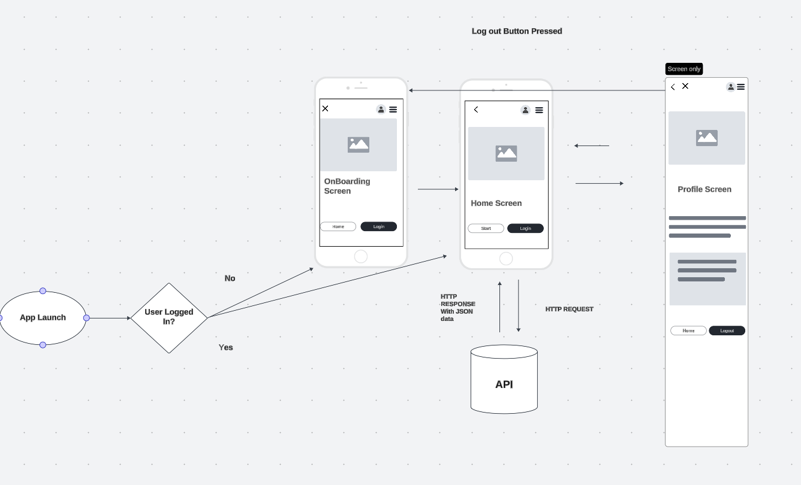

## little-lemon

##Little Lemon Food Ordering App

 (Coursera Android App Capstone by META. The final project of [Meta Android Developer Professional Certificate](https://www.coursera.org/professional-certificates/meta-android-developer).

## Overview
This Android application is the final project of the Coursera Capstone by META. It's written in Kotlin and utilizes Jetpack Compose for building its UI.

## Application Flow

## Preview

## Features
- Onboarding screen: prompts users to enter their personal details.
- Stack navigation: allows users to access the previous screen using the Back button.
- Home screen: features a header, hero section, menu breakdown section, and food menu list section.
- Theme: Use Theme to centralize styling.
- Profile screen: displays the user's personal details.
- Ability to save changes in the Profile screen that are retained when the app is restarted.

## Wireframe
The design of the Home screen is based on the following wireframe:

## Getting Started
To run the app, you'll need to have Android studio installed. Clone the repository and open the project in Android Studio. Then, build and run the app on a simulator or device.

## Requirements
Android SDK
Android Build Tools

## License
This project is licensed under the MIT License - see the [License.md](LICENSE.md) file for details.

